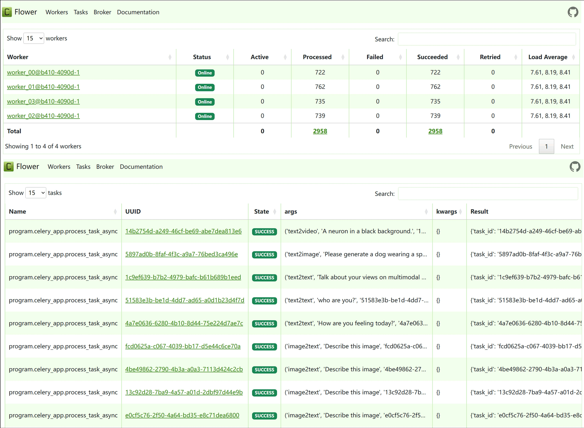
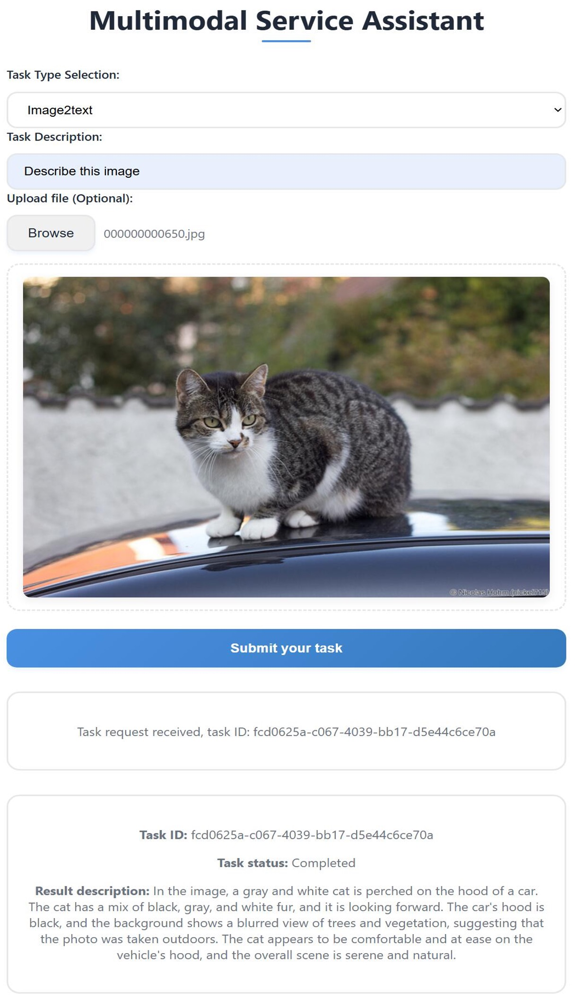

# DIAMM

<div align="center">

**分布式智能多模态管理系统**

一个基于 Kubernetes 的多模态 AI 服务编排与管理平台

[](https://opensource.org/licenses/MIT)

</div>

---

## 📋 目录

- [项目简介](#-项目简介)
- [核心特性](#-核心特性)
- [系统架构](#-系统架构)
- [快速开始](#-快速开始)
  - [环境要求](#环境要求)
  - [依赖安装](#依赖安装)
  - [服务启动](#服务启动)
- [使用指南](#-使用指南)
- [示例展示](#-示例展示)
- [项目结构](#-项目结构)
- [许可证](#-许可证)

---

## 🚀 项目简介

DIAMM (Distributed Intelligent Multimodal Management) 是一个企业级的多模态 AI 服务管理平台，支持文本、图像、视频等多种模态的 AI 模型统一调度与管理。系统基于 Kubernetes 构建，提供高可用、可扩展的分布式服务架构。

### 主要功能

- 🔄 **多模态任务调度**：支持文本生成、图像生成、视频生成等多种任务类型
- ⚡ **高性能推理**：基于 vLLM 和优化的推理引擎
- 📊 **资源监控**：集成 Prometheus、DCGM、Jtop 和 Tegrastats，实时监控 GPU 使用情况
- 🔐 **模型管理**：支持模型权重完整性检查、分布式部署
- 🌐 **Web 界面**：提供友好的 Web UI 进行任务提交和结果查看

---

## ✨ 核心特性

- ✅ 基于 Kubernetes 的容器化部署
- ✅ 支持多种多模态模型（LLM、图像生成、视频生成）
- ✅ 智能资源调度算法（QMSD）
- ✅ 实时任务状态监控（Celery + Flower）
- ✅ 向量数据库支持（PGVector）
- ✅ 分布式缓存（Redis）
- ✅ RESTful API 接口
- ✅ 并发测试工具

---

## 🏗️ 系统架构

```
┌─────────────────┐
│   Web Frontend  │
└────────┬────────┘
         │
┌────────▼────────┐     ┌──────────────┐
│   FastAPI       │────▶│   Celery     │
│   Service       │     │   Workers    │
└────────┬────────┘     └──────┬───────┘
         │                      │
┌────────▼──────────────────────▼───────┐
│      Kubernetes Cluster               │
│  ┌──────────┐  ┌──────────┐          │
│  │  vLLM    │  │ Multimodal│         │
│  │  Models  │  │  Models   │         │
│  └──────────┘  └──────────┘          │
└───────────────────────────────────────┘
         │
┌────────▼────────┐     ┌──────────────┐
│   PostgreSQL    │     │    Redis     │
│   (PGVector)    │     │   (Cache)    │
└─────────────────┘     └──────────────┘
```

---

## 🚀 快速开始

### 环境要求

- Kubernetes 集群（推荐 1.24+）
- Docker 或容器运行时
- Python 3.8+
- 至少 1 个 GPU 节点（用于模型推理）
  - 支持 x86 架构（Intel/AMD CPU + NVIDIA GPU）
  - 支持 ARM 架构（NVIDIA Jetson 系列设备）
- NFS 服务器（用于模型权重共享）

### 依赖安装

#### 1. 数据库服务

我们推荐使用 Docker 或 Kubernetes 部署 PostgreSQL 和 Redis。

##### PostgreSQL (PGVector)

**镜像地址：**
```
docker.io/ankane/pgvector:v0.5.1
```

**推荐配置（ConfigMap）：**
```yaml
work_mem = 64MB
shared_buffers = 6GB
maintenance_work_mem = 512MB
```

##### Redis

**镜像地址：**
```
docker.io/library/redis:7.2-alpine
```

**推荐配置（redis.conf）：**
```conf
maxmemory 10GB
bind 0.0.0.0
protected-mode no
requirepass "123456"
```

#### 2. 多模态模型镜像

系统需要在 Kubernetes 工作节点上预置以下 Docker 镜像：

| 模型类型 | 镜像地址 | 说明 |
|---------|---------|------|
| LLM 推理 | `docker.io/library/lmdeploy-new:v0.6.4-cu11` | 基于 LMDeploy 的 LLM 服务 |
| Ollama | `docker.io/ollama/ollama:latest` | Ollama 模型服务 |
| 视频生成 | `docker.io/library/cogvideox2b:0.1` | CogVideoX 视频生成模型 |
| 图像生成 | `docker.io/aoirint/sd_webui:0.2` | Stable Diffusion WebUI |

> 💡 **提示**：后两个镜像的 Dockerfile 位于 `Multimodal_files/` 目录，分别基于官方模型和 Xformer 优化版本构建。

#### 2.1. Jetson 环境配置

> 🎯 **ARM 架构支持**：Jetson 设备使用 ARM 架构，镜像与 x86 环境不同。

对于 Jetson 设备（NVIDIA Jetson 系列），我们已在 `Jetson/` 目录中提供了对应的 ARM 架构镜像 Dockerfile 以及相关配置文件：

- **ARM 架构镜像 Dockerfile**：适用于 Jetson 设备的容器镜像构建文件
- **jtop 等存储资源查询工具**：用于监控 Jetson 设备的存储和资源使用情况

**使用方法：**
1. 进入 `Jetson/` 目录查看对应的 Dockerfile
2. 使用 ARM 架构的 Dockerfile 替换 x86 版本的镜像构建文件
3. 根据 Jetson 设备的具体型号和配置进行相应调整

> ⚠️ **注意**：Jetson 环境下的镜像需要针对 ARM 架构重新编译，不能直接使用 x86 架构的镜像。

#### 3. Prometheus 监控

系统通过 Prometheus 查询容器状态，需要 DCGM 插件获取 GPU 使用情况。

**配置文件位置：** `/prometheus/dcgm-exporter-servicemonitor.yaml`

将配置文件加载到 Kubernetes 集群中：
```bash
kubectl apply -f prometheus/dcgm-exporter-servicemonitor.yaml
```

#### 4. Python 环境

使用 Conda 安装 Python 依赖：

```bash
conda env create -f environment.yml
conda activate diamm
```

---

### 服务启动

#### Master 节点服务

在 Master 节点上启动以下服务进程：

##### 1. 任务结果展示服务
```bash
cd vLLM-k8s-operator/user_tasks
python show.py
```

##### 2. 向量嵌入服务
```bash
cd vLLM-k8s-operator/models/embedding
python main.py
```

##### 3. FastAPI 主服务
```bash
cd vLLM-k8s-operator
python -m program.fastapi_app
```

##### 4. QMSD 调度算法服务
```bash
cd vLLM-k8s-operator/deployment/deployment_design
python algorithm_proposed.py
```

##### 5. DIAMM 多模态预热服务
```bash
cd vLLM-k8s-operator/deployment/service_drop
python main.py
```

##### 6. 权重完整性检查服务
```bash
cd vLLM-k8s-operator/check_weight
python main.py
```

##### 7. Prometheus-DCGM 检查服务
```bash
cd vLLM-k8s-operator/check_weight
python Prometheus_start.py
```

##### 8. Web 前端服务
```bash
python web-end.py
```

#### NFS 服务器服务

在 NFS 服务器上启动以下服务：

##### 1. 权重分发服务
```bash
cd NFS_server/send_weight
python main_drop.py
```

##### 2. 文件服务
```bash
cd NFS_server
python show.py
```

#### Celery 任务队列

使用 Supervisor 管理 Celery 服务：

**配置文件位置：** `/etc/supervisor/conf.d/celery.conf`

```bash
# 重新加载配置
sudo supervisorctl reread

# 更新服务
sudo supervisorctl update

# 重启所有服务
sudo supervisorctl restart all
```

> 📝 **注意**：后续版本将提供容器化部署方案和自动化启动脚本。

---

## 📖 使用指南

启动所有服务后，您可以通过以下两种方式使用 DIAMM 多模态服务：

### 1. 并发测试程序

使用内置的并发测试工具进行压力测试和性能评估：

```bash
cd test
python send_task.py
```

**功能特性：**
- ✅ 可配置并发数量
- ✅ 支持多种任务类型（文本、图像、视频等）
- ✅ 可自定义任务类型比例
- ✅ 实时统计任务执行情况

### 2. Web 界面访问

系统提供友好的 Web 界面进行任务提交和结果查看：

**访问地址：** `http://localhost:8989`

**功能包括：**
- 📝 任务提交
- 📊 任务状态查询
- 🖼️ 结果预览和下载
- 📈 执行统计

> ⚠️ **性能提示**：如果任务执行时间较长（低频使用场景），建议至少保留一份常用模型的副本，避免频繁清理导致的冷启动延迟。

---

## 🖼️ 示例展示

### Celery-Flower 任务监控

实时查看任务执行状态和队列情况：



### Web UI 界面

通过 Web 界面查看任务执行结果：



---

## 📁 项目结构

```
DIAMM/
├── vLLM-k8s-operator/          # 核心服务模块
│   ├── program/                # FastAPI 主程序
│   ├── deployment/             # 部署相关
│   │   ├── deployment_design/  # QMSD 调度算法
│   │   └── service_drop/       # 服务预热
│   ├── models/                 # 模型相关
│   │   └── embedding/          # 向量嵌入服务
│   ├── check_weight/           # 权重检查
│   └── user_tasks/             # 任务管理
├── NFS_server/                 # NFS 服务器
│   ├── send_weight/            # 权重分发
│   └── show.py                 # 文件服务
├── Multimodal_files/           # 多模态模型文件
│   ├── CogVideoX/              # 视频生成模型
│   └── Stable-diffusion/       # 图像生成模型
├── Jetson/                     # Jetson ARM 架构支持
│   ├── Dockerfile/             # ARM 架构镜像构建文件
│   └── jtop/                   # 存储资源查询工具
├── prometheus/                 # Prometheus 配置
├── test/                       # 测试工具
│   ├── send_task.py           # 并发测试
│   └── source_datasets/       # 测试数据集
├── web-end.py                  # Web 前端服务
├── celery.conf                 # Celery 配置
└── environment.yml             # Python 环境配置
```

---

## 📄 许可证

本项目采用 [MIT License](LICENSE) 许可证。

---

<div align="center">

**⭐ 如果这个项目对您有帮助，欢迎 Star！**

Made with ❤️ by DIAMM Team

</div>
